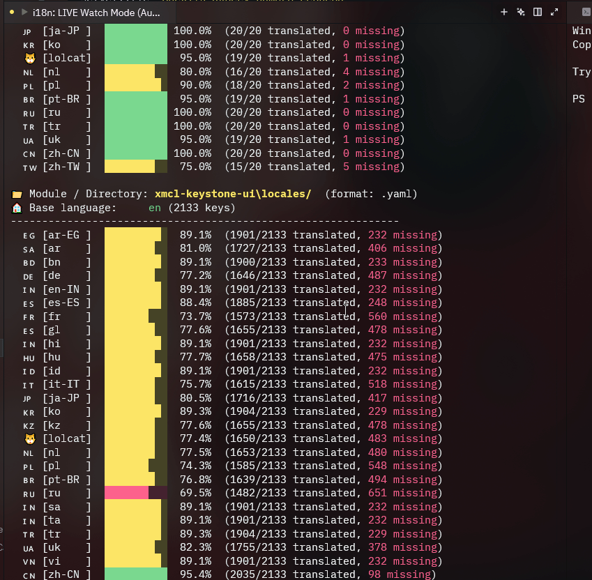
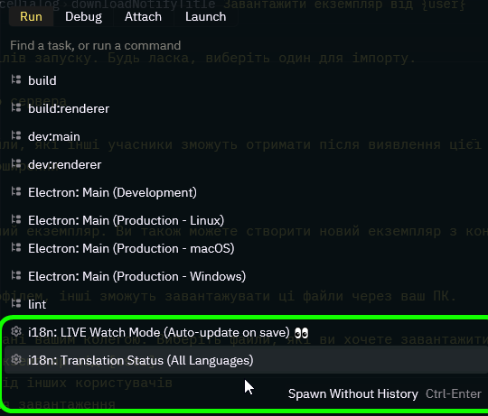
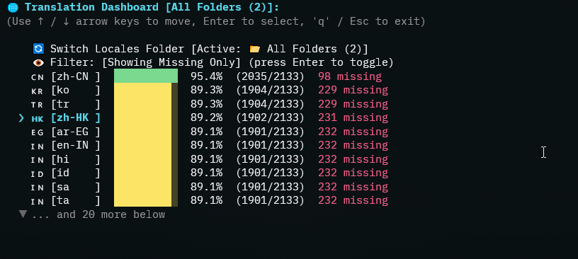
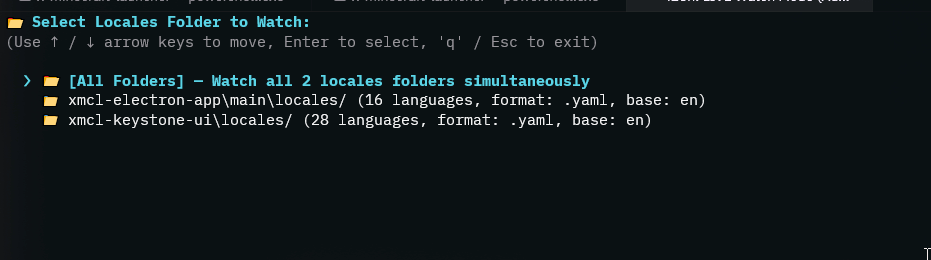

# 🌐 i18n-zed — Universal i18n Ally for Zed Editor

> **⚠️ Alpha Release (v0.1.0-alpha)**: This extension is currently in early alpha preview. Features and interfaces are actively evolving. Feedback, bug reports, and contributions are warmly welcomed!

A universal internationalization (i18n) management extension for [Zed Editor](https://zed.dev) — inspired by *i18n Ally* for VS Code.

Manage translations seamlessly across any framework (React, Vue, Svelte, Next.js, Nuxt, Laravel, Django, Electron, Tauri) and file formats (`.json`, `.yaml`, `.yml`) with instant coverage dashboards, multi-folder monorepo auto-detection, and real-time live watch mode.

---

## 🎬 Live Demo & How It Works



### How It Works:

#### 1. Launch from Zed Tasks
Press `Ctrl+Shift+P` (or `Cmd+Shift+P` on macOS), type `task: spawn`, and choose your i18n action:



- **`i18n: Inspect Missing Keys 🔍`**: Interactive arrow-key menu (`↑`/`↓` + `Enter`) to inspect coverage, switch locales folders, auto-translate with Google Translate, and export templates.
- **`i18n: LIVE Watch Mode (Auto-update on save) 👀`**: Interactive live watcher with folder switching (`s` or `Enter`) and instant diff updates on file save.

#### 2. Interactive Translation Dashboard (Zero-Typing Navigation)
Navigate languages effortlessly with arrow keys (`↑` / `↓`) and `Enter`! View visual progress bars for each locale, switch between folders in monorepos, toggle between missing-only and completed languages, auto-translate missing keys with free Google Translate, or export ready-to-use translation templates:



#### 3. Interactive Multi-Folder Selection in Live Watch Mode
Working in a monorepo or project with multiple locales directories? When starting Live Watch Mode, you can interactively choose which folder to monitor, or watch all folders simultaneously, with instant on-the-fly folder switching (`s` or `Enter`):



#### 4. Real-Time Feedback as You Code
Whenever you add or translate a key in any locale file, Live Watch Mode immediately detects the change and logs:
```text
🔄 [11:15:22] locales/uk.yaml updated:
  ✅ +1 key(s) translated: 'settings.notifications'
  📊 uk: ████████░░ 82.4% (1756/2133 translated) (+1 key translated!)
```

---

## ✨ Key Features

- 🌐 **Universal File Formats**: Full support for **JSON** (`.json`, `.jsonc`, `.json5`), **YAML** (`.yaml`, `.yml`), **TOML** (`.toml`), **Java / Android Properties** (`.properties`), **GNU Gettext PO** (`.po`), and **Flutter ARB** (`.arb`).
- 📦 **Monorepo & Multi-Folder Detection**: Recursively discovers all locale folders across complex monorepos without manual path configuration (e.g. `src/locales`, `locales`, `public/locales`, `resources/lang`, `apps/*/locales`).
- 📊 **Visual Coverage Dashboard**: Clean, ASCII progress bars, translation completion percentages, and missing key counts for every module.
- 🌍 **All World Languages + Special Locales**: Built-in flag support for 60+ languages and regional dialects (`zh-CN`, `pt-BR`, `es-419`, `ar-EG`, `en-US`), as well as gaming locales like `lolcat` (`🐱`).
- ⚡ **Live Watch Mode**: Automatically recalculates coverage whenever you save a translation file, showing exact diffs (`+1 key translated`).
- 🤖 **Auto-Translate with Free Google Translate**: Automatically translate untranslated keys in batch with zero API keys required, with preview or direct save into all supported formats (`.json`, `.yaml`, `.toml`, `.properties`, `.po`).
- 🕹️ **Zero-Typing Arrow-Key Navigation**: Interactively browse languages and actions with keyboard arrow keys (`↑` / `↓` and `Enter`).
- 🔍 **LSP Diagnostics & Hover**: Highlights missing translation keys directly inside source code (`t()`, `$t()`, `__()`, `trans()`) and shows translations across all languages on hover.
- 🛠️ **Seamless Zed Tasks Integration**: Run dashboards directly from the Zed Command Palette (`Ctrl+Shift+P` → `task: spawn`).

---

## 🚀 Getting Started (Installation)

### Prerequisites
- [Zed Editor](https://zed.dev) (v0.170.0 or later recommended)
- [Node.js](https://nodejs.org) (v18+ recommended)
- [Rust](https://rustup.rs) with `wasm32-wasip2` target:
  ```bash
  rustup target add wasm32-wasip2
  ```

### 1. Clone the Repository
```bash
git clone https://github.com/BANSAFAn/i18n-zed.git
cd i18n-zed
```

### 2. Install Dependencies & Build Extension
```bash
# Install Node dependencies & compile TypeScript via tsup
cd lsp
npm install
npm run build     # Compiles TypeScript into high-performance standalone bundles in lsp/dist/
cd ..

# Compile the WASM extension (embeds lsp/dist/server.js)
cargo build --target wasm32-wasip2 --release
cp target/wasm32-wasip2/release/zed_i18n.wasm extension.wasm
# (On Windows PowerShell: Copy-Item target\wasm32-wasip2\release\zed_i18n.wasm -Destination extension.wasm -Force)
```

### 3. Install as Dev Extension in Zed
1. Open Zed.
2. Press `Ctrl+Shift+P` (or `Cmd+Shift+P` on macOS) to open the Command Palette.
3. Type and select: `zed: install dev extension`.
4. Select the cloned `i18n-zed` folder.
5. The extension is now active!

---

## ⚙️ Configuration

### Global Tasks (`tasks.json`)
To access i18n commands from any project via `task: spawn`, add the following to your Zed global tasks:

- **Windows**: `%APPDATA%\Zed\tasks.json`
- **macOS/Linux**: `~/.config/zed/tasks.json`

```json
[
  {
    "label": "i18n: Inspect Missing Keys 🔍",
    "command": "node",
    "args": ["<PATH_TO_I18N_ZED>/lsp/cli.js", "--interactive"],
    "use_new_terminal": true,
    "allow_concurrent_runs": false
  },
  {
    "label": "i18n: LIVE Watch Mode (Auto-update on save) 👀",
    "command": "node",
    "args": ["<PATH_TO_I18N_ZED>/lsp/cli.js", "--watch"],
    "use_new_terminal": true,
    "allow_concurrent_runs": false
  }
]
```
*(Replace `<PATH_TO_I18N_ZED>` with your local repository path, e.g. `E:/github/zed-i18n`).*

### Language Server Settings (`settings.json`)
You can configure language server behaviors and custom translation function names in your Zed settings (`Ctrl+Shift+P` → `zed: open settings`):

```jsonc
{
  "languages": {
    "JavaScript": { "language_servers": ["i18n-lsp", "..."] },
    "TypeScript": { "language_servers": ["i18n-lsp", "..."] },
    "TSX": { "language_servers": ["i18n-lsp", "..."] },
    "Vue": { "language_servers": ["i18n-lsp", "..."] },
    "PHP": { "language_servers": ["i18n-lsp", "..."] }
  },
  "lsp": {
    "i18n-lsp": {
      "settings": {
        // Optional: override if your path is non-standard
        "localesPath": "src/locales",
        "baseLocale": "en",
        // Functions to scan for translation keys
        "translationFunctions": ["t", "$t", "__", "trans"],
        "missingKeySeverity": "warning"
      }
    }
  }
}
```

---

## 📖 Usage

### Option 1: Zed Tasks (Recommended)
1. Press `Ctrl+Shift+P` (or `Cmd+Shift+P` on macOS) → type `task: spawn`.
2. Choose your action:
   - **`i18n: Inspect Missing Keys 🔍`**: Interactive arrow-key menu (`↑`/`↓` + `Enter`) to inspect coverage, switch locales folders, auto-translate with Google Translate, and export templates.
   - **`i18n: LIVE Watch Mode (Auto-update on save) 👀`**: Interactive live watcher with folder switching (`s` or `Enter`) and instant diff updates on file save.
3. View the report or interactive picker directly in Zed's terminal!

### Option 2: Live Watch Mode
Keep your translations up-to-date while you code:
1. Press `Ctrl+Shift+P` → `task: spawn`.
2. Select **`i18n: LIVE Watch Mode (Auto-update on save) 👀`**.
3. Whenever you add or edit a key in any translation file, you will immediately see live updates and progress bar recalculations.

### Option 3: Terminal CLI
You can also run the CLI tool directly from your terminal:
```bash
# Translation status overview
node <PATH_TO_I18N_ZED>/lsp/cli.js

# Interactive arrow-key navigation (no typing needed!)
node <PATH_TO_I18N_ZED>/lsp/cli.js -i

# Inspect untranslated keys for a specific language
node <PATH_TO_I18N_ZED>/lsp/cli.js uk
node <PATH_TO_I18N_ZED>/lsp/cli.js pl

# Auto-translate missing keys with free Google Translate (preview)
node <PATH_TO_I18N_ZED>/lsp/cli.js uk --translate

# Auto-translate and save directly into locale file(s)
node <PATH_TO_I18N_ZED>/lsp/cli.js uk --translate --save

# Show all untranslated keys without truncation
node <PATH_TO_I18N_ZED>/lsp/cli.js uk --all

# Export missing keys as a ready-to-translate JSON template
node <PATH_TO_I18N_ZED>/lsp/cli.js uk --template

# Run in live watch mode
node <PATH_TO_I18N_ZED>/lsp/cli.js --watch
```

---

## 💻 TypeScript Development & Building

The LSP server and CLI engine are written in **TypeScript** under `lsp/src/` and bundled with **tsup**:

```bash
cd lsp

# Build production bundles to lsp/dist/ (server.js & cli.js)
npm run build

# Run TypeScript type checker without emitting code
npm run typecheck

# Watch mode during development (auto-rebuilds on save)
npm run watch
```

### 🧪 How to Test & Verify

To quickly test the CLI and translation engine on the included `test-project`:

1. **Verify Translation Status Overview**:
   ```bash
   node lsp/cli.js --dir test-project/locales
   ```
2. **Test Interactive Arrow-Key Menu**:
   ```bash
   node lsp/cli.js --dir test-project/locales -i
   ```
   *(Navigate with `↑` / `↓` and press `Enter` to inspect missing keys or preview translations).*
3. **Test Auto-Translate Preview**:
   ```bash
   node lsp/cli.js --dir test-project/locales uk -t
   ```
4. **Test Live Watch Mode**:
   ```bash
   node lsp/cli.js --dir test-project/locales -w
   ```
   *(Open `test-project/locales/uk.json` in any editor, add a key, and save — the terminal will immediately show the live diff!)*

---

## 🗺️ Roadmap

- [x] Multi-framework JSON & JSONC (`.json`, `.jsonc`, `.json5`) support
- [x] Multi-module & monorepo automatic directory discovery
- [x] YAML (`.yaml`, `.yml`) parsing & coverage calculation
- [x] TOML (`.toml`) file format support
- [x] Java / Android Properties (`.properties`) file format support
- [x] GNU Gettext PO (`.po`) file format support
- [x] Flutter ARB (`.arb`) file format support
- [x] Full world languages & dialects support + `lolcat` (`🐱`)
- [x] Live Watch Mode with instant diff detection
- [x] Free Google Translate auto-translation of missing keys
- [x] Zero-typing interactive arrow-key selector (`↑`/`↓` + `Enter`)
- [x] Missing key diagnostics in source files via LSP
- [x] Fully typed TypeScript codebase with lightning-fast `tsup` bundling
- [ ] In-editor inline ghost text showing translated preview next to keys
- [ ] Quick-fix Code Actions to add missing keys directly from editor
